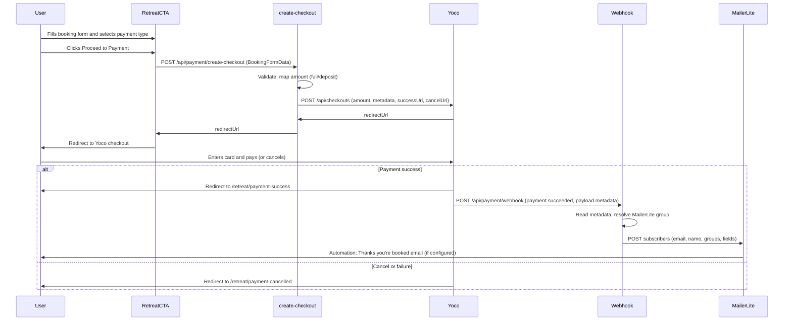

# Retreat Booking, Payment & MailerLite Data Flow

Short reference for the signup form → Yoco payment → MailerLite flow. Use for debugging, onboarding, and future features (e.g. new products, different payment amounts, extra form fields).

---

## Flow diagram



---

## 1. Booking form (client)

**Where:** `components/retreat/RetreatCTA.vue`

**Data collected:** `BookingFormData` (`types/payment.ts`)

| Field | Required | Notes |
|-------|----------|--------|
| firstName | Yes | |
| lastName | Yes | |
| email | Yes | |
| phone | Yes | |
| dietaryRequirements | No | Optional text |
| paymentType | Yes | `'full'` or `'deposit'` |

**Flow:** User submits → `handleSubmit()` POSTs to `/api/payment/create-checkout` with the form body. On success, client redirects to `redirectUrl` (Yoco hosted checkout). On error, message from API is shown (e.g. validation or Yoco error).

**Important:** No payment happens in our app. We only create a checkout and redirect; card details are on Yoco.

---

## 2. Create checkout (server)

**Where:** `server/api/payment/create-checkout.post.ts`

**Input:** Same as `BookingFormData` (from request body).

**Validation:** `firstName`, `lastName`, `email`, `phone` required; `paymentType` must be `'full'` or `'deposit'`.

**Amounts (cents):** `full` → 600000 (R6,000), `deposit` → 200000 (R2,000). Defined in `AMOUNTS` in the handler.

**Config:** `yocoSecretKey` (server), `public.siteUrl` (redirect base). Redirects are `{siteUrl}/retreat/payment-success` and `{siteUrl}/retreat/payment-cancelled` (also used for failure).

**Outbound call:** `POST https://payments.yoco.com/api/checkouts` with:
- `amount`, `currency: 'ZAR'`
- `successUrl`, `cancelUrl`, `failureUrl`
- `metadata`: all booking fields (firstName, lastName, email, phone, paymentType, dietaryRequirements if present). Yoco echoes this in webhooks.

**Response to client:** `{ redirectUrl }`. Client does a full redirect to that URL.

**Extending:** New products = new amount map and/or paymentType values. New form fields = add to form, to `BookingFormData`, to validation, and to `metadata` so the webhook receives them.

---

## 3. User on Yoco

User completes or cancels payment on Yoco’s page. We do not handle card data.

- **Success:** Yoco redirects to `successUrl` → our `/retreat/payment-success` page.
- **Cancel / Failure:** Yoco redirects to `cancelUrl` or `failureUrl` → our `/retreat/payment-cancelled` page.

Payment confirmation is **not** inferred from the redirect. It is confirmed only when Yoco sends a `payment.succeeded` webhook (next section).

---

## 4. Webhook: payment.succeeded → MailerLite

**Where:** `server/api/payment/webhook.post.ts`

**Inbound:** Yoco POSTs to `/api/payment/webhook` (must be registered with Yoco; URL must be publicly reachable).

**Payload shape:** Top-level `type` and `payload`. For payments, `payload.metadata` is the same object we sent when creating the checkout.

**Processing:**
1. If `type !== 'payment.succeeded'`, return `{ received: true }` and do nothing.
2. Read `payload.metadata`: email (required), firstName, lastName, phone, paymentType, dietaryRequirements.
3. If email missing, log and return 200 (no retry).
4. Resolve group: `mailerLiteRetreatGroup` if set, else `mailerLiteNewsletterGroup`. Both from runtime config.
5. Call MailerLite `POST https://connect.mailerlite.com/api/subscribers` (new API) with `Authorization: Bearer` and:
   - `email`, `name` (firstName + lastName), `groups: [groupId]`
   - `fields`: name, last_name, phone, payment_type, source: `'retreat_booking'`, dietary_requirements (if present)
6. On duplicate (400/409 + “already exists”), log and return 200. On other errors, throw so Yoco can retry.

**Important:** Only successful payments trigger this. Cancelled or failed payments never hit the webhook with `payment.succeeded`, so no MailerLite add.

---

## 5. MailerLite

**Config:** `mailerLiteApiKey` (Bearer token from Integrations → Generate new token), `mailerLiteNewsletterGroup`, `mailerLiteRetreatGroup`. Uses new MailerLite API (`connect.mailerlite.com`).

**Custom fields used:** name, last_name, phone, payment_type, dietary_requirements. Create custom fields in MailerLite (Subscribers → Fields) if needed. Do not use `source` — it is reserved by MailerLite.

**Finding the Group ID:** Integrations (sidebar) → MailerLite API → Use → scroll to the Groups section. Use the Group ID listed there — **not** the form ID from exported HTML (e.g. `179669244645999671` is a form ID), subscriber ID, or form container ID. Group IDs look like `4243829086487936`.

**Automation (outside this codebase):** In MailerLite, an automation “Subscriber joins group” (Retreat Bookings or main group) can send the “Thanks, you’re booked” email. Merge tags: {name}, {last_name}, {email}, {phone}, {payment_type}, {dietary_requirements}.

---

## 6. Data flow summary

```
[RetreatCTA form]
  → POST /api/payment/create-checkout (BookingFormData)
  → Server validates, maps amount, calls Yoco with metadata
  → Client redirects to Yoco checkout URL

[User pays on Yoco]
  → Yoco redirects to /retreat/payment-success or /retreat/payment-cancelled

[Yoco server]
  → POST /api/payment/webhook (type: payment.succeeded, payload.metadata)
  → Webhook handler reads metadata, POSTs to MailerLite subscribers API
  → MailerLite automation (if configured) sends confirmation email
```

---

## 7. Key files for future changes

| Concern | File(s) |
|--------|---------|
| Form fields / validation | `components/retreat/RetreatCTA.vue`, `types/payment.ts` |
| Amounts, redirect URLs, metadata | `server/api/payment/create-checkout.post.ts` |
| Who gets added to MailerLite and how | `server/api/payment/webhook.post.ts` |
| Success / cancel UX | `pages/retreat/payment-success.vue`, `pages/retreat/payment-cancelled.vue` |
| Env / config | `nuxt.config.ts`, `.env`, Vercel env vars |

**Adding a new product or amount:** Update `AMOUNTS` and/or paymentType in create-checkout; ensure form and types match. Metadata and webhook already pass through arbitrary fields; add MailerLite custom fields if you want to segment or display them.
